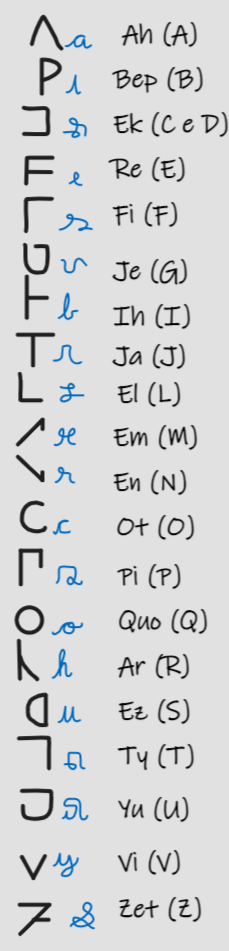

# Ecotiez (Ecotiezian language) full reference
## Alphabet (20 letters)
ngl this is so weird lmao

## Basic pronounce rules
### Repeating letters
- Examples
    + **Ek** + **Ek** = **Éek**
    + **Zet** + **Zet** = **Zéet**
    + **Ar** + **Ar** = **Áar**
- Conclusion
    + **X Letter** + **X Letter** = **X Letter with emphasis on pronunciation vowels**

## Language
### Letters' functions
#### Class Prefixes
- **Ty** = Noun
- **Fi** = Adjective
- **Zet** = Plural word
- **Ek** = Object-related word
- **Ot** = Article
#### Action Prefixes
- **Pi** = Present action
- **Quo** = Past Action
- **Ih** = Future Action
#### Person suffixes
- **Re** = 1st person
- **El** = 3rd person
#### Gender suffixes
- **Bep** = Male
- **Ah** = Female
### Pronouns
#### Personal Pronouns
##### 1st person
- **I**/**me** = Re
- **We** =  **Zet** + **Re** = Zetre
##### 3rd person
- **He**/**You** = **Bep** + **El** = Bepel
- **She**/**You** = **Ah** + **El** = Ahel 
- **It** = El
- **They** = **Zet** + **El** = Zetel
#### Possessive Pronouns
##### 1st person
- **My**/**Mine** = **Ek** + **Re** = Ekre
- **Our** = **Zet** + **Ek** + **Re** = Zetekre
##### 3rd person
- **His** = **Ek** + **El** + **Bep** = Ekelbep
- **Her** = **Ek** + **El** + **Ah** = Ekelah
- **Its** = **Ek** + **El** = Ekel
- **Their** = **Zet** + **Ek** + **El** = Zetekel
### Articles
#### Defined
- **The** = Ot
- **The** (plural) = **Ot** + **Zet** = Otzet
#### Undefined
- **A**/**An** = **Ot** + **Ek** = Otek
> The undefined article works with plural words!
### 